<p align="center">
  
</p>

<h1 align="center">Building REST APIs with FastAPI</h1>

<p align="center"><b>A production-ready FastAPI starter.</b> Type-safe requests, automatic interactive docs, async SQLAlchemy, JWT auth and a full test suite — the modern-Python API baseline, ready to build on.</p>

<p align="center">
  <a href="https://www.python.org/downloads/"></a>
  
  
  
  <a href="LICENSE"></a>
</p>

---

## Why FastAPI

You annotate your request and response types once, and FastAPI does the rest: **validates** every request against your Pydantic schema, **serializes** typed responses, and **generates interactive docs** at `/docs` and `/redoc` — all with async speed on Starlette.

## What's inside

<p align="center">
  
</p>

- **Routers** (`app/routers/`) — `auth` and `users` endpoints.
- **Schemas** (`app/schemas/`) — Pydantic models validate requests and shape responses.
- **Models** (`app/models/`) — SQLAlchemy ORM, async.
- **Security** (`app/utils/security.py`) — JWT auth guarding protected routes.
- **Tests** (`tests/`) — pytest across auth, users and the app.
- **Docker** — a multi-stage `Dockerfile` and `docker-compose.yml`.

## Quick start

```bash
git clone https://github.com/ry-ops/building-rest-api-fastapi.git
cd building-rest-api-fastapi
python -m venv venv && source venv/bin/activate      # Windows: venv\Scripts\activate
pip install -r requirements.txt
cp .env.example .env                                  # set SECRET_KEY etc.
uvicorn app.main:app --reload
```

Then open:
- **API** — http://localhost:8000
- **Swagger UI** — http://localhost:8000/docs
- **ReDoc** — http://localhost:8000/redoc

<details>
<summary><b>Docker</b></summary>

```bash
docker compose up --build
```
</details>

```bash
pytest                 # run the test suite
```

## Learn from it

The tutorial docs walk through the design, development and deployment:
- [documentation/API.md](documentation/API.md)
- [documentation/DEVELOPMENT.md](documentation/DEVELOPMENT.md)
- [documentation/DEPLOYMENT.md](documentation/DEPLOYMENT.md)

There's also an [`examples/client.py`](examples/client.py) showing how to call the API.

## License

MIT. See [LICENSE](LICENSE).

<!-- org-footer -->
---

<p align="center"><sub>Part of <a href="https://github.com/ry-ops">ry-ops</a> · building the pipes between infrastructure, automation, and observability · built by <a href="https://github.com/ry-ops">ry-ops</a></sub></p>
